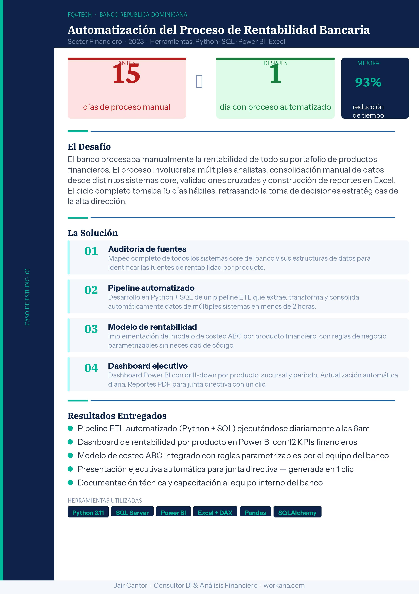

# ⚡ Quick Start - Cambios Rápidos

## 🎨 Cambiar Color Principal (30 segundos)

### Localiza en `styles.css`:
```css
:root {
  --color-primary: #236aa5;        ← AQUÍ
  --color-primary-dark: #102b57;   ← AQUÍ (botón hover)
  --color-primary-light: #00c2a8;  ← AQUÍ (acento)
```

### Cambia los valores:
```css
--color-primary: #TU_COLOR;
--color-primary-dark: #COLOR_OSCURO;
--color-primary-light: #COLOR_CLARO;
```

**¡Listo!** Se propaga a todo el sitio automáticamente.

---

## 🏷️ Cambiar Meta Tags (1 minuto)

### En `index.html`, encuentra:
```html
<title>Jair Cantor | Consultor BI & Análisis Financiero</title>
<meta name="description" content="...">
```

### Cambios recomendados:
```html
<title>MI_TITULO | MI_SUBTITULO</title>
<meta name="description" content="NUEVA_DESCRIPCION (max 160 caracteres)">

<!-- OpenGraph para redes sociales -->
<meta property="og:title" content="MI_TITULO">
<meta property="og:description" content="NUEVA_DESCRIPCION">
<meta property="og:image" content="URL_MI_IMAGEN">
```

---

## 📝 Cambiar Contenido de Texto (Directo)

### En `index.html`, edita directamente:

**Hero section (línea ~45):**
```html
<h1>Datos financieros listos para decidir, no solo para reportar.</h1>
                          ↓
<h1>TU_TITULO_AQUI</h1>
```

**Descripción (línea ~50):**
```html
<p class="hero-lede">
  Construyo dashboards Power BI...
</p>
                          ↓
<p class="hero-lede">TU_DESCRIPCION</p>
```

---

## 🖼️ Cambiar Imágenes (Sencillo)

### Guardar imagen en `/assets/`:
```
assets/
├── case-bank-automation.jpg      ← AQUÍ
├── case-retail-dashboard.jpg     ← AQUÍ
└── tu-nueva-imagen.jpg           ← NUEVA
```

### En `index.html`, actualiza referencias:
```html

                               ↓

```

---

## ➕ Agregar Nueva Sección (5 minutos)

### 1. Agregar HTML en `index.html`:
```html
<!-- Copiar una sección existente como template -->
<section class="section light" id="mi-seccion">
  <div class="section-intro">
    <p class="eyebrow">Sección Nueva</p>
    <h2>Mi Título Grande</h2>
    <p>Descripción corta</p>
  </div>
  <div class="mi-grid">
    <!-- Contenido aquí -->
  </div>
</section>
```

### 2. Agregar CSS en `styles.css`:
```css
.mi-grid {
  display: grid;
  grid-template-columns: repeat(3, 1fr);
  gap: var(--space-lg);
}

@media (max-width: 960px) {
  .mi-grid {
    grid-template-columns: repeat(2, 1fr);
  }
}

@media (max-width: 640px) {
  .mi-grid {
    grid-template-columns: 1fr;
  }
}
```

### 3. Si quieres animaciones, agregar en `modules/animations.js`:
```javascript
const animationSelectors = [
  // ... existing ...
  ".mi-grid"  // ← AGREGAR AQUÍ
];
```

---

## 🎬 Cambiar Velocidad de Transiciones (1 minuto)

### En `styles.css`:
```css
:root {
  --transition-fast: 120ms ease;    ← Más rápido
  --transition-base: 180ms ease;    ← Normal
  --transition-slow: 300ms ease;    ← Más lento
}
```

### Cambiar valores:
```css
--transition-fast: 80ms ease;     /* Más rápido */
--transition-slow: 500ms ease;    /* Más lento */
```

---

## 🌙 Ajustar Colores para Modo Oscuro (2 minutos)

### En `styles.css`:
```css
@media (prefers-color-scheme: dark) {
  :root {
    --color-text: #f0f4f8;
    --color-background: #0a1628;
    --color-surface: #1a2942;
    --color-border: #2a4270;
  }
}
```

### Cambiar valores según necesites:
```css
--color-text: #TU_COLOR_TEXTO;
--color-background: #TU_COLOR_FONDO;
```

---

## 📱 Ajustar Breakpoints Responsive (2 minutos)

### En `styles.css`, busca:
```css
@media (max-width: 960px) {
  /* Tablets */
}

@media (max-width: 640px) {
  /* Mobile */
}
```

### Cambiar valores:
```css
@media (max-width: 1024px) {  /* Aumentar tablet */
  /* ... */
}

@media (max-width: 480px) {   /* Disminuir mobile */
  /* ... */
}
```

---

## 🔗 Cambiar Link de Contacto

### En `index.html`, busca:
```html
<a class="button primary dark-button" href="https://www.workana.com/" target="_blank">
  Contactar en Workana
</a>
```

### Cambiar URL:
```html
<a class="button primary" href="https://www.tu-url.com/">
  Tu Texto Aquí
</a>
```

---

## 🚀 Cambiar Logo/Brand (2 minutos)

### En `index.html`:
```html
<a class="brand" href="#inicio">
  <span class="brand-mark">JC</span>        ← CAMBIAR AQUÍ
  <span>Jair Cantor</span>                   ← CAMBIAR AQUÍ
</a>
```

### Cambiar a:
```html
<a class="brand" href="#inicio">
  <span class="brand-mark">TUS INICIALES</span>
  <span>TU NOMBRE</span>
</a>
```

### Cambiar estilo del logo en `styles.css`:
```css
.brand-mark {
  background: linear-gradient(135deg, #2be7c8, #f5d65f);  ← AQUÍ
}
```

---

## 📊 Modificar Grid de Servicios (1 minuto)

### En `styles.css`:
```css
.service-grid {
  grid-template-columns: repeat(3, 1fr);  ← 3 columnas
}

@media (max-width: 960px) {
  .service-grid {
    grid-template-columns: repeat(2, 1fr);  ← 2 columnas en tablet
  }
}
```

### Cambiar a 4 columnas:
```css
.service-grid {
  grid-template-columns: repeat(4, 1fr);  ← 4 columnas
}
```

---

## 💬 Cambiar Texto de Secciones Específicas

### Servicios (línea ~165)
```html
<section class="section light" id="servicios">
  <div class="section-intro">
    <p class="eyebrow">Servicios</p>          ← Label
    <h2>Soluciones financieras...</h2>       ← Título
    <p>Puedes empezar con...</p>             ← Descripción
  </div>
```

### Casos (línea ~210)
```html
<section class="section dark" id="casos">
  <div class="section-intro compact">
    <p class="eyebrow">Casos de exito</p>
    <h2>Resultados demostrables...</h2>
```

### Paquetes (línea ~260)
```html
<section class="section pricing-section" id="paquetes">
  <div class="section-intro">
    <p class="eyebrow">Servicios & paquetes</p>
    <h2>Tres paquetes...</h2>
```

---

## 🔧 Cambiar Precio de Paquetes (Directo)

### En `index.html`, línea ~300:
```html
<article class="price-card">
  <p>Basico</p>
  <h3>$90 USD</h3>           ← CAMBIAR AQUÍ
  <span>Entrega: 3 dias</span>
```

### Cambiar a:
```html
<h3>$120 USD</h3>
```

---

## 🔐 Cambiar URLs SEO (1 minuto)

### En `sitemap.xml`:
```xml
<loc>https://jaircantor.com/</loc>
                  ↓
<loc>https://tudominio.com/</loc>
```

### En `manifest.json`:
```json
"start_url": "/",
```

### En `.htaccess`:
No necesita cambios si usas HTTPS y www redirection

---

## ✅ Testing Rápido Después de Cambios

```bash
1. Guardar archivo
2. Ctrl+Shift+R (hard refresh en navegador)
3. F12 → DevTools → Console (buscar errores)
4. Revisar que cambio se ve correctamente
```

---

## 🎯 Cambios Comunes y Sus Ubicaciones

| Cambio | Archivo | Línea | Dificultad |
|--------|---------|-------|-----------|
| Color principal | styles.css | 1-10 | ⭐ Muy fácil |
| Meta tags | index.html | 5-30 | ⭐ Muy fácil |
| Texto contenido | index.html | 45+ | ⭐ Muy fácil |
| Imágenes | index.html | 135+ | ⭐ Muy fácil |
| Precios | index.html | 300+ | ⭐ Muy fácil |
| Modo oscuro | styles.css | 55-65 | ⭐⭐ Fácil |
| Nueva sección | index.html + styles.css | Varios | ⭐⭐⭐ Medio |
| Agregar animación | modules/animations.js | 30-50 | ⭐⭐⭐⭐ Avanzado |

---

## 💡 Pro Tips

### Tip 1: Usar búsqueda
```
Ctrl+F en index.html para encontrar texto rápido
```

### Tip 2: Duplicar sección
```
Copiar una sección existente como template
Cambiar los IDs (id="nueva-id")
Cambiar las clases si es necesario
```

### Tip 3: Backup antes de cambios
```
Hacer copia: styles.css → styles.css.bak
Hacer copia: index.html → index.html.bak
```

### Tip 4: Validación
```
Usar: validator.nu para verificar HTML
Usar: jigsaw.w3.org para verificar CSS
```

---

## 🔄 Cambios Frecuentes (Checklist)

- [ ] Actualizar título y meta description
- [ ] Cambiar colores principales
- [ ] Cambiar logo/brand
- [ ] Actualizar content copy
- [ ] Cambiar precios
- [ ] Agregar/cambiar imágenes
- [ ] Actualizar links de contacto
- [ ] Revisar en móvil

---

**¡Listo para cambios rápidos! 🚀**

Si necesitas algo más complejo, revisa [ARCHITECTURE.md](ARCHITECTURE.md)
